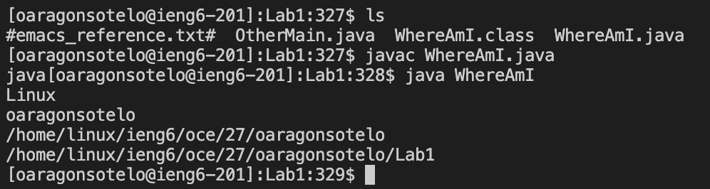

# Lab Report 1

#### Step 1
Install [VSCODE](https://code.visualstudio.com/download)

 
<p1>What I did here was open the link, click download (I used mac) and installed the program once it finished. From there you are almost ready!<p1>

 

#### Step 2
Connect remotely using your regular 'student account'@ieng6.ucsd.edu and the password we asked you to reset in the pre-lab

<p1>
-First I opened VSCode and installed all extentions as needed (already setup during pre-lab). Then for mac, on the top left of my entire screen, I see a "Terminal" button. I clicked terminal and typed ssh followed by my username and password.
<p1>

 

#### Step 3
Try running some basic commands like `cd`, `ls`, `pwd`
-After logging into ieng6 secure server, you are free to use many commands. I can use `ls` to view files in current directory and `cd` to navigate into them. `pwd` is used to view the current file path. 

 

#### Step 4
For this next step, I used the `logout` command to move to my local client, as well as the `ls` and `cd` commands to be sure I am in the directory of the file I am going to copy to our ieng6 server using the `scp` command.

-Keep in mind, this `scp` command was done in the local client (your computer **NOT** ieng6 server). The general syntax is as follows: `scp file_name host_server@addres:server_file_destination`
file destination can replaced by  `~/` shortcut and this will place your file into your main directory (**it may ask you for your password, use same password as login**). From there, your output should look similar to above and you can confirm your file has the expected contents with the `cat` command.

 

#### Step 5
This next step will help us skip having to identify ourselves, allowing us to log into ieng6 without having to constantly insert our passwords. The following steps must be done in your client:
   -`ssh-keygen`
   -`/Users/<user-name>/.ssh/id_rsa`(save to your local client)
   -**It will ask you to pick a passphrase, leave empty!**
   -log into ieng6 server
   -(make directory in .ssh) `mkdir .ssh`
   -`logout`
   -`scp /Users/<your_user_name>/.ssh/id_rsa.pub your_user@ieng6.ucsd.edu:~/.ssh/authorized_keys`
   -Enter password if asked and you are done! You can now use `ssh` and `scp` without needing to insert your password. 

    
   

   If you did all the steps correctly, your output should be similar to below:

**Before: ssh command requires password**

**After: ssh recognizes your computer and no longer asks you for your password**

1. **LETS GOoooo!** Now you are ready to get comfortable and run java files remotely. 

Try it yourself:
* upload a java file via `ssh` command
* compile and run java files via `javac` `java` commands

