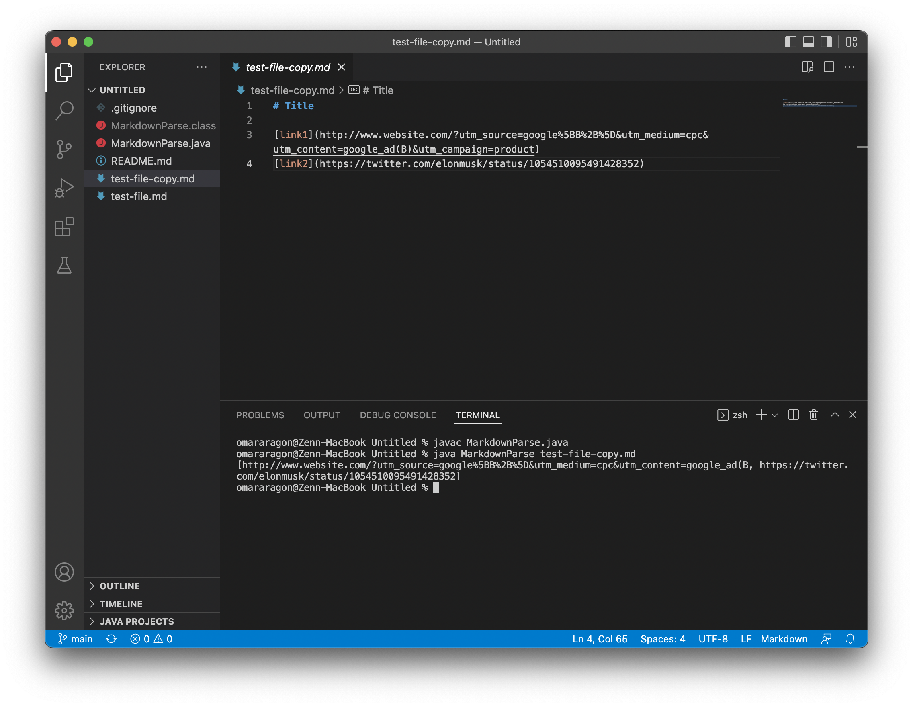
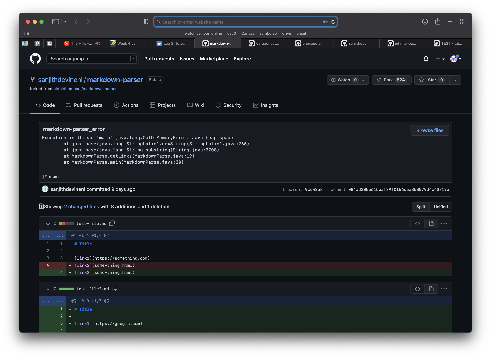

# Lab Report 2

### Code-Change Example 1 Courtesy of [@NickAzp](https://github.com/NickAzp/markdown-parser/commit/199122a04ef17ed5777edb5f37f5b4b14a170754)

Original Code Change:

Symptoms of the failure-inducing output:
* By definition, what I can only see as of now what part of Nick's code is failing is the The first link being stored/printed as `...content=google_ad(B,` instead of `...content=google_ad(B)&utm_campaign=product`.

* From my understanding of debugging, every error in a program has a logical explanation. From what we know about the getLines method in MarkdownParse.java, this bug can be explained by an error in the index iterator caused the the extra set of paraenthesis found inside the first link. This causes the link to be stored prematurely, thus the program printing incorrectly. 

### Code-Change Example 2 Courtesy of [@sanjithdevineni](https://github.com/sanjithdevineni/markdown-parser/commit/084ad3055615baf39f0156cea853079d4c43719a)

Original Code Change: 

* Changed were made to this fork, presumably removing the test case or by solving the problem. I concluded that this error was no longer present because I tried running `MarkdownParse.java` with all the test files in this repo an was unsuccessful in producing the same output, as shown here: 
  

* As for what I think the relationship between the bug, symptom, and the failure-inducing output are: the bug may be an incorrect command at the terminal ( for example `java MarkdownParse <incorrect file>`) or some other incorrect implementation that causes large amounts of memory usage that would eventually run out of heap space, the symptom is of course the output `Exception in thread "main" java.lang.OutOfMemoryError: Java heap space` showing this error was caused due to an error caused by insufficient heap space at run time, the failure inducing output is also very easy to determine because the program did not print the links as intended but instead threw an exception error with a stack trace.

### Code-Change Example 2 Courtesy of [@R3dbAbyVamp](https://github.com/R3dbAbyVamp/markdown-parser/commit/ec6417f7e3c6a815d28422a2184bc202615a84cf)

Original Code Change: 

* From the looks of this original commit comment, an infinte loops ran with the testing.md file. So the symptom of this failure output may have been nothing happening because VS code simply runs forever and does not reach the code that prints an output. 

* From my attempt to run this -testing.md file, I have found that it does work now. Once the tester file was tweaked to not include an additional line after the last link. The symptom was the lack of output (infinite loop) in VS code, which caused a bug in the getLinks method index iterator being unable to increment up to the last character in the markdown file, resulting in the infinte loop in the output.
