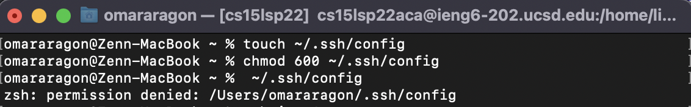

### Step 1: Streamlining `ssh` Configuration

Here is how I initially created my .`ssh/config`:  

... and how I was able to edit it via my built-in text editor: 

...to eventually do this `ssh ieng6` command: 

Now, if we wanted to create a file on our local machine with `touch`: 

... and copy it over to our ssh linux machine with `ssh`, it would look something like this: 

### Step 2: Setup Github Access from ieng6 

