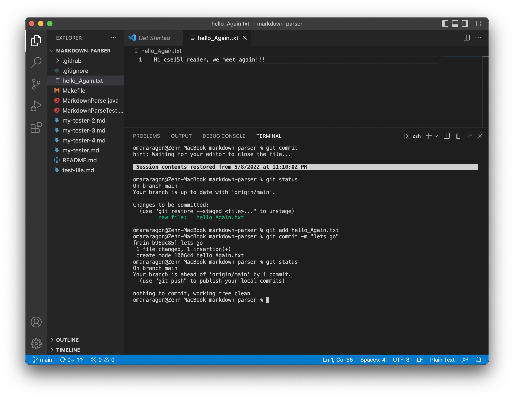
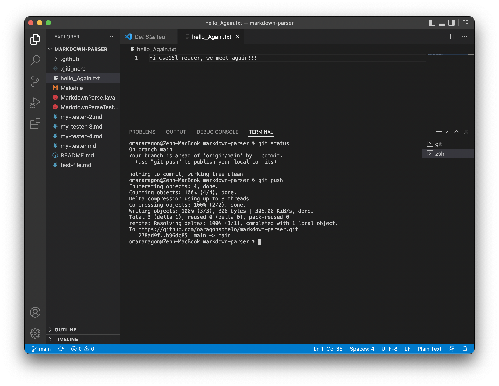
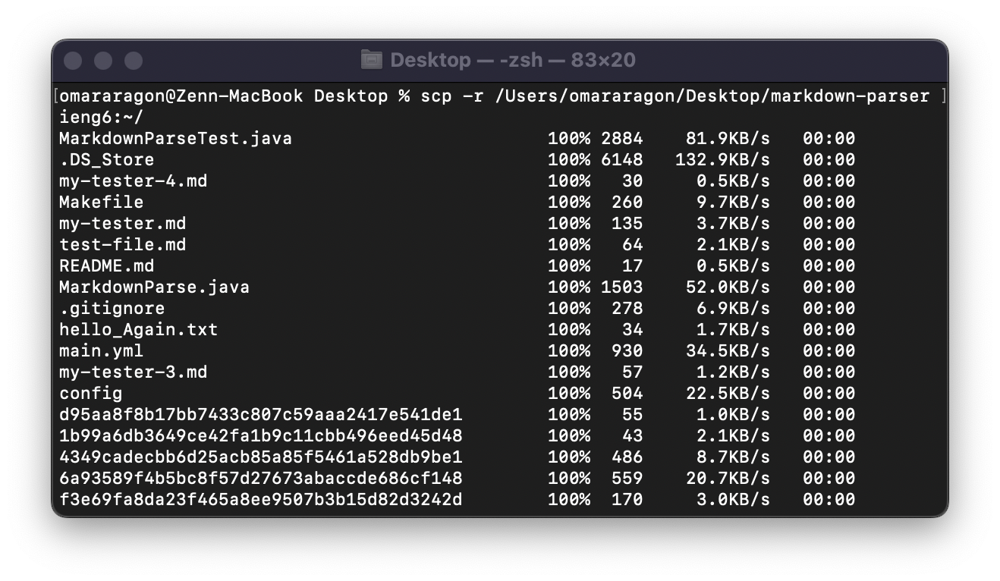
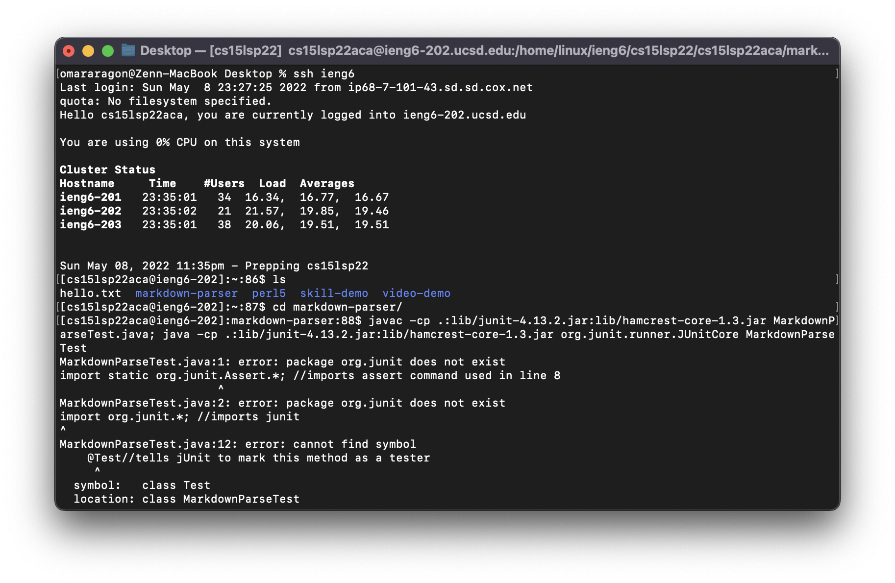

### Step 1: Streamlining `ssh` Configuration

Here is how I initially created my `ssh/config`:  

... and how I was able to edit it via my built-in text editor: 

...to eventually do this `ssh ieng6` command: 

Now, if we wanted to create a file on our local machine with `touch`: 

... and copy it over to our ssh linux machine with `ssh`, it would look something like this: 

### Step 2: Setup Github Access from ieng6 
Once we have used the `ssh` command to log into my linux machine, I was able to move into the `.ssh` directory to create a new `id_rsa_github.pub` public key using `ssh-keygen`: 

...and here is my new `id_rsa_github.pub` key added to my github account!: 

... and this helps me accomplish cool new tasks such as `git commit` commands!:  [LINK TO COMMIT](https://github.com/oaragonsotelo/markdown-parser/commit/b96dc85638b6eeac647435d2154e04f477649534)

### Step 3: Copy whole directories wit `scp -r`

First we start by using the `scp -r` as shown here: 

... next lets compile and run the tester with one line! (here I try to compile and run the tester, but it results in a failure inducing output. However, the lab report does not specify that the output must be non-failure, so hopefully this will do for now!):
