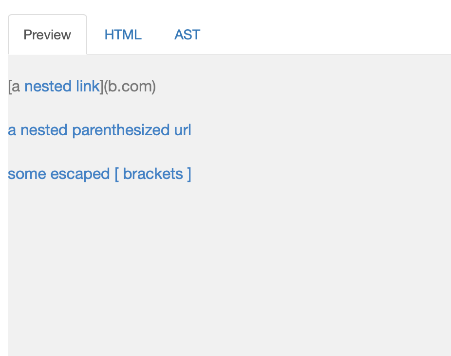

# Lab Report 4
links: [my markdown-parser repo](https://github.com/oaragonsotelo/markdown-parser); [other repo](https://github.com/oaragonsotelo/otherMDrepo)

### Snippet One:
###### Expected: 

###### My Implementation:

My implementation PASSED!

###### Reviewed Implementation:

This implementation also PASSED!

### Snippet Two:
###### Expected: 
###### My Implementation:

My implementation FAILED... with this output: 
###### Reviewed Implementation:

This implementation also FAILED... with this output: 

### Snippet Three:
###### Expected: 
###### My Implementation:

My implementation FAILED... with this output: 

###### Reviewed Implementation:

This implementation also FAILED... with this output:

(Infinite Loop)

### Questionaire:

1. Do you think there is a small (<10 lines) code change that will make your program work for snippet 1 and all related cases that use inline code with backticks? If yes, describe the code change. If not, describe why it would be a more involved change: 

- Fortunately this test case PASSED!

1. Do you think there is a small (<10 lines) code change that will make your program work for snippet 2 and all related cases that nest parentheses, brackets, and escaped brackets? If yes, describe the code change. If not, describe why it would be a more involved change.

- I do think that this text case can be solved in less than 10 lines of code. Maybe if we asserted code that counts finds the last close parenthesis in that single line, we can use that to "hug" all the stuff in between for an accureate link.

3. Do you think there is a small (<10 lines) code change that will make your program work for snippet 3 and all related cases that have newlines in brackets and parentheses? If yes, describe the code change. If not, describe why it would be a more involved change.

- This case, I feel like, would require many lines of code. Testing for things across different lines in the markdown file would require a lot of conditional statements. This test case is bizzare because you would have to had checked 3 different lines in the `.md` file in order to figure out the right output. 