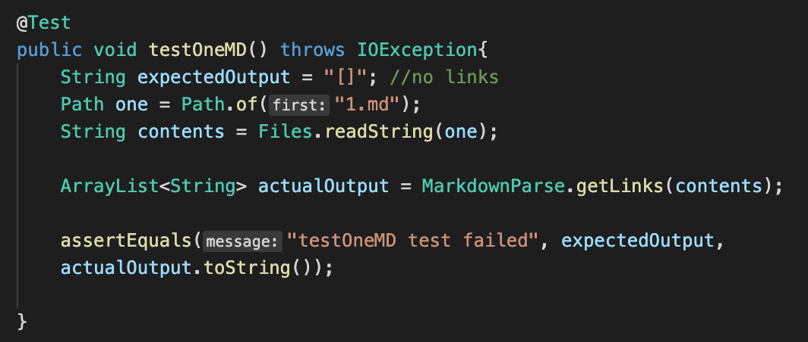
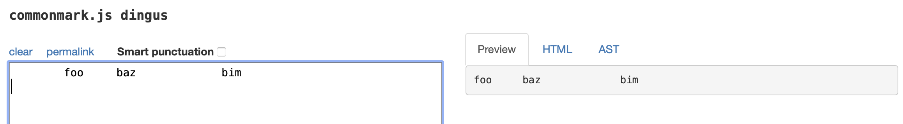
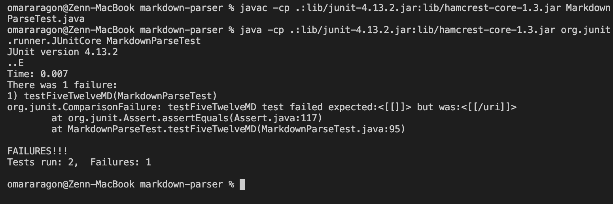
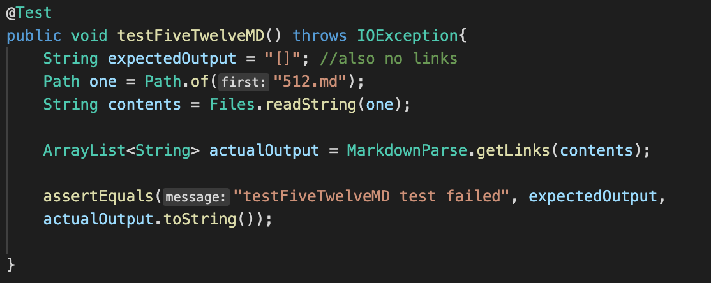
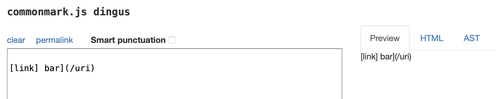
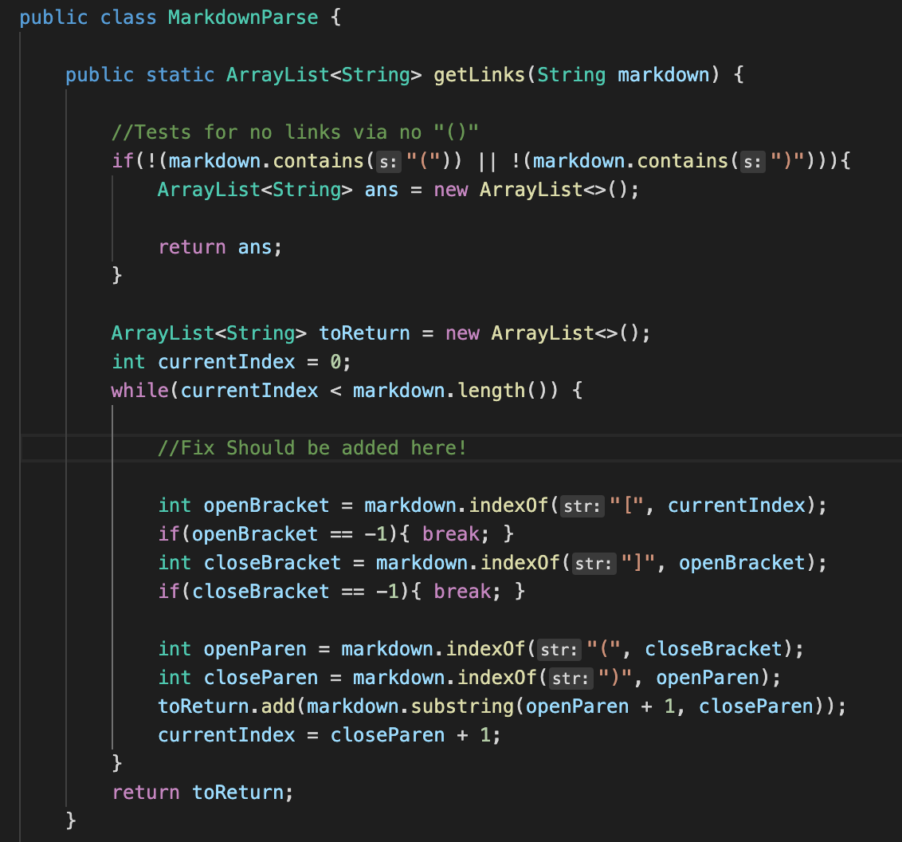

# Lab Report 5

## Test 1
This first test was found manually and randomly -> [Link to test](https://github.com/nidhidhamnani/markdown-parser/blob/main/test-files/1.md)

PASSED jUnit Test: 

Expected Output: 

Actual Output (PASSED): 

## Test 2
This second test was also found manually and randomly -> [Link ot test](https://github.com/nidhidhamnani/markdown-parser/blob/main/test-files/512.md)

jUnit Test: 

Expected Output: 

Actual Output (FAILED): 

Where Can We Improve?: 

* Here is the spot (shown with a comment) where we can add more implementation to check and possibly pass this edge case. At the moment, this method only searches for the next brackets and parenthesis, but not neccessarily verifying if the user (or md) file intended that to be a link. So if we added implementation to the spot, like another few lines that check if the brackets and parenthesis are enclosed properly for a link, there is a better chance that this passes in the future!
